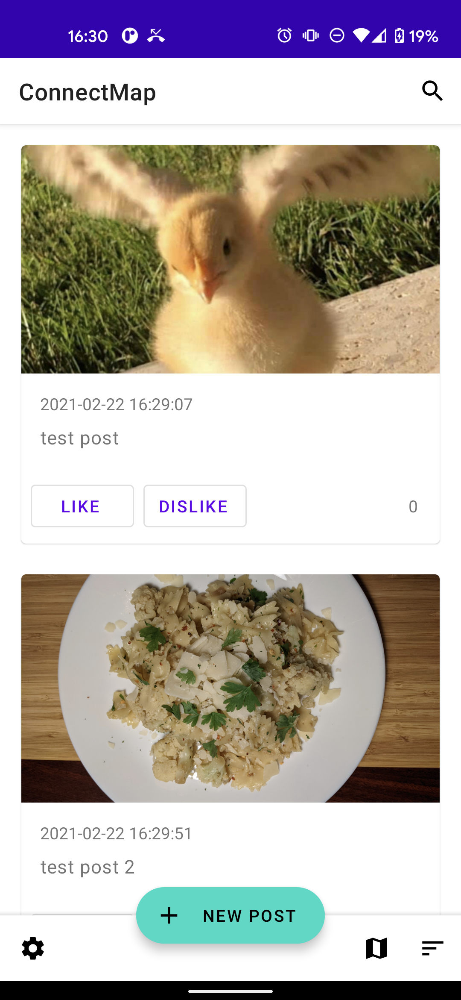
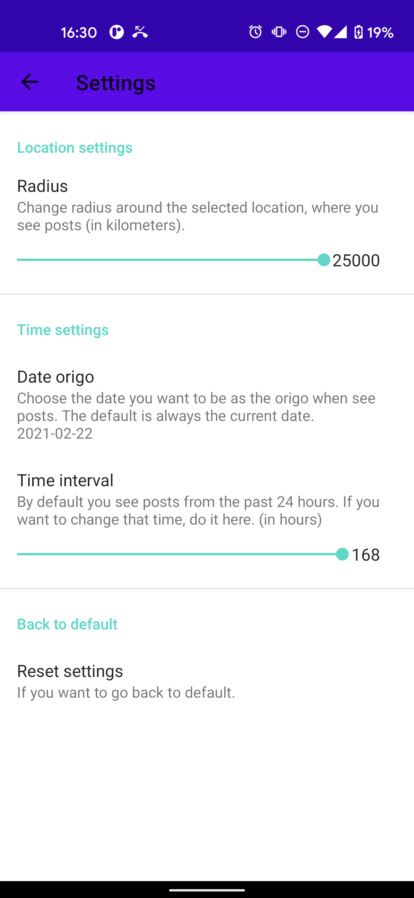
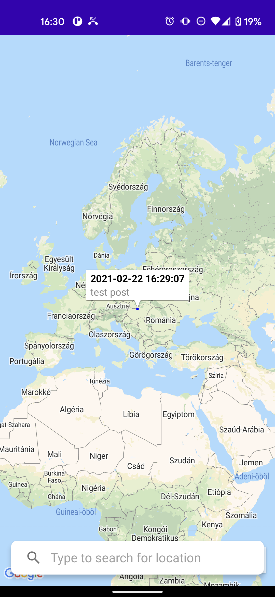
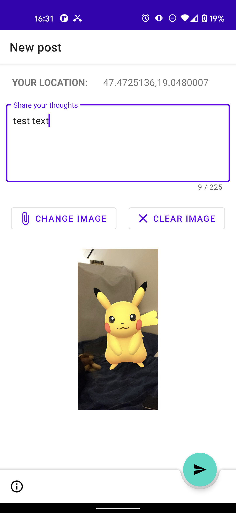

# ConnectMap
ConnectMap was one of my first Android projects related to my Andorid Development university course based on Firebase and Google Maps API. It's a pretty simple clone of Yik Yak, you can share posts in an area, and everyone nearby you can see the post. In the settings you can change the radius in wich you want to see posts, and also the time interval. It shows the post on a Map, and the post size on the map is related to the upvotes it have. Users can search posts, upvote and downwote them. Posts include text and an optional image. All information is stored in a Firebase database. That's all basically.

